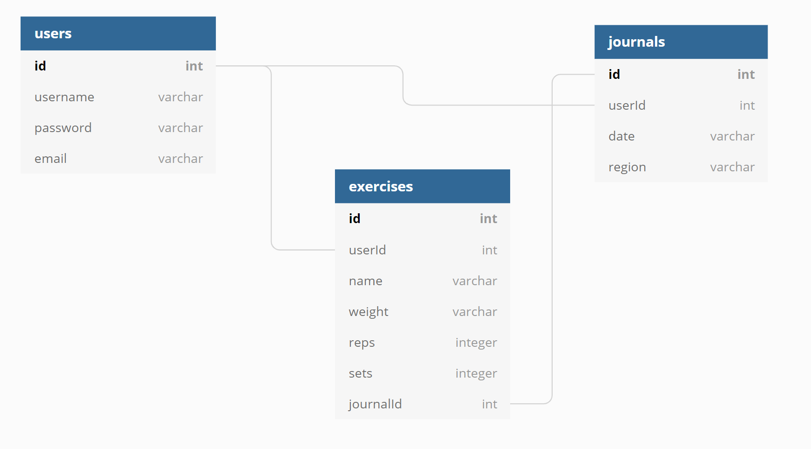

# Backend

# Database

## Table Diagram


## Models

### Users

```
{
    username: string, *REQUIRED*
    email: string,     *REQUIRED*
    password: string,  *REQUIRED*
}
```

### User Journals

```
{
    user_id: int,         *REQUIRED*
    date:    string,      *REQUIRED*
    region:  string,      *REQUIRED*
}
```

### User Exercises

```
{
    userId: int,          *REQUIRED*
    journalId: int,       *REQUIRED*
    name:      string,    *REQUIRED*
    weight:    string,    *REQUIRED*
    reps:      integer,   *REQUIRED*
    sets:      integer,   *REQUIRED*
}
```
# Endpoints

## Users

| Request Type | Endpoint                       | Description             |
|:------------:|:------------------------------:|:-----------------------:|
| POST         | /api/auth/register             | Creates User            |
| POST         | /api/auth/login                | Creates JWT             |
| GET          | /api/users                     | Returns All Users       |
| GET          | /api/users/:id                 | Returns User By ID      |
| PUT          | /api/users/:id                 | Update User             |
| DELETE       | /api/users/:id                 | Remove User             |

## User Journals
| Request Type | Endpoint                       | Description             |
|:------------:|:------------------------------:|:-----------------------:|
| GET          | api/api/journals/:id           | Get User Journals by ID |
| GET          | api/journals/users/:userId     | Get All User Journals   |
| POST         | api/journals                   | Add User journal        |
| PUT          | api/journals/:id               | Update User journal     |
| DELETE       | api/journals/:id               | Remove User journal     |

## User Exercises
| Request Type | Endpoint                          | Description                 |
|:------------:|:---------------------------------:|:---------------------------:|
| GET          | api/exercises/journals/:journalId | Get All User Exercises      |
| GET          | api/exercises/:id                 | Get Specific User Exercises |
| POST         | api/exercises                     | Add User Exercises          |
| PUT          | api/exercises/:id                 | Update User exercises       |
| DELETE       | api/exercises/:id                 | Remove User exercises       |

# API

## Auth Routes:

### POST
`/api/auth/register`

- Expects Following Shape

```
{
    username: string,  *REQUIRED*
    email: string,     *REQUIRED*
    password: string,  *REQUIRED*
}
```

`/api/auth/login`

- Expects Following Shape

```
{
    username: string,   *REQUIRED*
    password: string    *REQUIRED*
}
```

## User Routes

### GET

`api/users`

- Returns All Users In Database

`api/users/:id`

- Returns User That Matches ID

### PUT

`api/users/:id`

- Updates User Information

- Expects Following Shape, Only One Field Required

```
{
    username: string,  *OPTIONAL*
    email:    string,  *OPTIONAL*
    password: string,  *OPTIONAL*
}
```

### Delete

`api/users/:id`

- Removes User From Database That Matches ID

## User Journal Routes

### GET

`api/journals/users/:id`

- Returns All The Journals Stored By User With Matching ID

`api/journals/:id`

- Returns A Specific Journal That Matches The `journalId` For The User That Matches `id`

### POST

`api/journals`

- Expects The Following Shape

```
{
    "date":   *string*,
    "region": *string*,
	"userId": integer
}
```
### PUT

`api/journals/:id`

- Expects The Following Shape

```
{
    "date":   *string*,
    "region": *string*,
	"userId": integer
}
```

### DELETE

`api/journals/:id`

- Removed Journal That Matches `journalId` By User That Matches `id`


## Exercise Routes

### GET

`api/exercises/journals/:journalId`

- Returns All exercises That Matches exercises By journal `id`

`api/exercises/:id`

- Returns A Specific exercise That Matches `id` 

### POST

`api/exercises`

- Expects The Following Shape
- Field `user_id` Should Match `id`
- Field `journal_id` Should Match `id`

```
{
    "name":      *string*,
	"weight":    integer,
	"reps":      integer,
	"sets":      integer,
	"userId":    integer,
	"journalId": integer
}
```

### PUT

`api/exercises/:id`

- Updates exercise Information
- Expects Following Shape
- Only One Field Required Per Request

```
{
    "name":      *string*,
	"weight":    integer,
	"reps":      integer,
	"sets":      integer,
	"userId":    integer,
	"journalId": integer
}
```

### DELETE

`api/exercises/:id`

- Removed Task That Matches `exerciseId` 

